# E-commerce Platform Architecture

**Assessment section 2 — Architecture Design Challenge**
Author: Benyamin Pravalent Siregar · Target role: Software Architect Engineer, Majoo Indonesia

---

## 1. Scope and how to read this

The brief asks for a scalable e-commerce platform supporting more than 10,000
concurrent users, multiple payment gateways, real-time inventory, order
processing and tracking, and search plus recommendations.

This document is organised so it can be read in three passes:

| If you want | Read |
|---|---|
| The shape of the system | §3 context, §4 services, §5 order flow |
| The hard parts | §6 payments, §7 inventory, §8 failure and compensation |
| The engineering judgement | §11 scalability, §12 security, §13 trade-offs, §14 evolution |

Every diagram is followed by prose that says what it means and what it costs.
Where a number appears, §2 says whether it is an assumption, an estimate or a
target — none of them are measurements, because nothing here has been built.

---

## 2. Assumptions, estimates and targets

Nothing below is measured. Each row is labelled so no one mistakes a working
assumption for a benchmark.

### 2.1 Business assumptions

| # | Assumption | Why it matters |
|---|---|---|
| A1 | Indonesian market first, single country, IDR only, Jakarta plus one secondary region | Decides multi-AZ over multi-region, and one currency in the money model |
| A2 | Marketplace-style catalogue: ~5M SKUs across ~50k sellers | Search must be a dedicated engine, not `LIKE` on PostgreSQL |
| A3 | Flash sales are a first-class event, not an edge case | Hot-key handling and overselling prevention are core, not later work |
| A4 | Payment methods: cards, bank transfer / virtual account, e-wallets (GoPay, OVO, DANA), and pay-later | Multiple gateways with different callback semantics |
| A5 | Physical goods with third-party couriers | Fulfilment is asynchronous and externally driven |
| A6 | The company can meet PCI DSS SAQ A, not SAQ D | Card data must never touch our servers |

### 2.2 Capacity estimates

"10k concurrent users" is ambiguous, so it is made concrete here. These are
derived, not measured; the derivation is shown so a reviewer can disagree with
the inputs rather than the arithmetic.

| Quantity | Estimate | Derivation |
|---|---|---|
| Concurrent users | 10,000 baseline, 100,000 at flash-sale peak | Brief, plus a 10× event multiplier |
| Requests per second, baseline | ~2,000 | 10k users, one request per 5s of think time |
| Requests per second, peak | ~20,000 | Same ratio at 100k users |
| Read : write ratio | ~95 : 5 | Browse-heavy; typical for retail |
| Orders per day | ~50,000 baseline | 10k users, ~0.5% converting per session-hour |
| Orders per second at peak | ~500 | Flash sale: 30k orders in the first minute |
| Average order size | 2.5 line items | Assumption |
| Catalogue size | 5M SKUs, ~20 KB per product document | A2 |
| Search index size | ~100 GB with replicas | 5M docs, denormalised, ×2 replicas |
| Product image storage | ~15 TB | 5M SKUs × 6 images × ~500 KB |

The number that actually drives the design is **500 orders per second against a
finite inventory count**, not the 20k RPS. Twenty thousand mostly-cacheable
reads is a solved problem — CDN, Redis, read replicas. Five hundred concurrent
decrements of the same stock row is where correctness is won or lost, and §7 is
about that.

### 2.3 Service-level objectives

Targets, agreed with the business; not measurements.

| Journey | SLO | Error budget |
|---|---|---|
| Product page (p95) | < 300 ms | 99.9% availability |
| Search (p95) | < 500 ms | 99.9% |
| Add to cart (p95) | < 200 ms | 99.95% |
| Checkout submit (p99) | < 2 s | 99.95% |
| Payment callback processing (p99) | < 5 s | 99.99% |
| Order state visible to customer after payment | < 10 s | 99.9% |

| Recovery objective | Target |
|---|---|
| RPO, order and payment data | 0 for committed transactions — synchronous replica plus WAL archiving |
| RPO, catalogue and search | 15 minutes — rebuildable from the source of truth |
| RTO, whole platform, AZ loss | < 5 minutes, automatic |
| RTO, whole platform, region loss | < 4 hours, manual, documented runbook |

---

## 3. System context

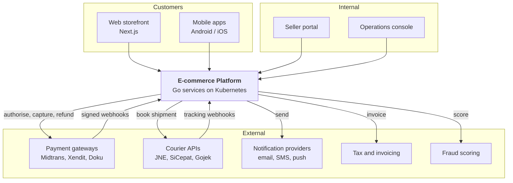

**What this says.** Four classes of client reach one platform. Five external
dependencies matter, and three of them — payments, couriers and fraud — call
*back* into us. That bidirectional arrow is the single most important detail on
the diagram: every inbound webhook is an untrusted, unordered, possibly
duplicated message from a party whose retry policy we do not control. §6.3
covers how each is verified and de-duplicated.

**What it costs.** Each external integration is a failure domain we cannot fix
during an incident. Every one of them therefore needs a circuit breaker, a
timeout, and a defined degraded behaviour (§11.6).

---

## 4. Service architecture

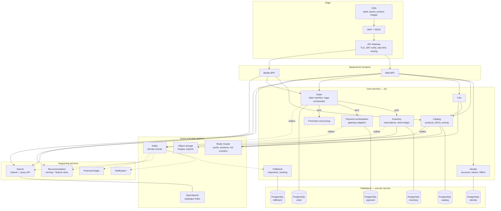

**What this says.** Solid arrows are synchronous calls; dotted arrows are
asynchronous events. Read the dotted lines first: almost everything downstream
of a completed order — fulfilment, notifications, search indexing,
recommendations, the ledger — is driven by events, not by the order service
calling them. The order service knows about exactly three peers: inventory,
payment and promotion. Everything else finds out by subscribing.

That is a deliberate line. If order had to call notification, then a notification
outage would fail checkouts. It does not, so it cannot.

**What it costs.** Every dotted line is eventual consistency the product team has
to accept: an order is placed before its confirmation email exists, and a
just-published product is searchable a second or two later. §9 states the
convergence window for each, and §10.5 covers what to show a user in the gap.

---

### 4.1 Service boundaries and ownership

Each service owns its data exclusively. No service reads another's tables;
`JOIN`s across service boundaries are replaced by an API call, a denormalised
copy kept fresh by events, or a rethink of the boundary.

| Service | Owns | Does not own | Sync callers | Publishes |
|---|---|---|---|---|
| **API Gateway / BFF** | Routing, TLS, coarse rate limits, response shaping per client | Any business rule | — | — |
| **Identity** | Accounts, credentials, sessions, roles, addresses | Order history | All | `user.registered`, `user.suspended` |
| **Catalog** | Products, SKUs, attributes, categories, list price, media references | Stock levels, promotional price | BFF, Cart, Search indexer | `product.created`, `product.updated`, `price.changed` |
| **Cart** | Cart contents, cart-scoped promotions | Prices, availability, order state | BFF | `cart.abandoned` |
| **Order** | Order aggregate and its state machine; **orchestrates the checkout saga** | Stock, money movement, delivery | BFF, Ops | `order.placed`, `order.confirmed`, `order.cancelled`, `order.completed` |
| **Inventory** | Stock ledger, reservations, availability per location | Prices, orders | Order, Cart (read-only), Ops | `stock.reserved`, `stock.released`, `stock.committed`, `stock.low` |
| **Payment orchestration** | Gateway adapters, payment intents, callbacks, refunds | Order state, ledger balances | Order | `payment.authorised`, `payment.captured`, `payment.failed`, `payment.refunded` |
| **Fulfilment** | Shipments, courier bookings, tracking events | Order state | Ops | `shipment.created`, `shipment.delivered` |
| **Promotion** | Vouchers, campaign rules, budget counters | Cart contents | Cart, Order | `voucher.redeemed` |
| **Search** | The query index. **Owns no source of truth** | Products, prices, stock | BFF | — |
| **Recommendation** | Models, feature store, serving | Anything transactional | BFF | — |
| **Notification** | Templates, delivery, per-channel preferences | Why a message is being sent | — | `notification.sent`, `notification.failed` |
| **Financial ledger** | Double-entry postings, settlement, reconciliation | Payment gateway state | Finance ops | — |

#### What starts inside a modular monolith, and when it leaves

Thirteen services on day one would be a mistake. Each one is an extra deploy
pipeline, an extra database to back up, an extra hop to debug — paid for
immediately, in exchange for scaling and isolation benefits that only arrive
later. The plan is a **modular monolith with the boundaries above enforced in
code**, split only when a specific pressure appears.

| Component | Start as | Extract when | Because |
|---|---|---|---|
| Identity | Module | Third-party or B2B login arrives | Different compliance surface; a separate audit boundary |
| Catalog | Module | Catalogue writes contend with order writes, or seller onboarding needs its own release train | Read-heavy, very different scaling curve |
| Cart | Module, Redis-backed | Never, probably | Almost stateless; the module is a thin wrapper over Redis |
| **Order** | Module | **Last thing to move** | It is the transactional core; every split makes checkout more distributed |
| **Inventory** | **Extract early (phase 1)** | From the start | Its write pattern — hot-row contention under flash sales — is unlike anything else, and it must scale and fail independently |
| **Payment** | **Extract early (phase 1)** | From the start | **PCI scope containment.** Keeping it separate keeps the audit boundary small — this is the strongest single argument for a split in the whole design |
| Fulfilment | Module | Courier count exceeds ~3, or a partner needs isolated rate limits | Integration-heavy, low transaction volume |
| Promotion | Module | Campaign rules need their own release cadence | Business-driven change frequency |
| **Search** | **Separate from day one** | From the start | Different data store, different runtime, different failure mode; already separate by construction |
| **Recommendation** | **Separate from day one** | From the start | Python/ML stack, batch plus serving; nothing in common with the transactional services |
| Notification | Module | Volume justifies its own queue-worker fleet | Pure event consumer; trivial to lift out |
| Ledger | Module | Finance requires an independent audit boundary | Correctness and retention matter more than latency |

**Phase 1 therefore ships five deployables:** the modular monolith
(identity, catalog, cart, order, promotion, fulfilment, notification, ledger),
inventory, payment, search, and recommendation. That is enough separation to
contain PCI scope and to scale the contended path, and few enough that a small
team can operate it.

---

## 5. Order placement — the critical flow

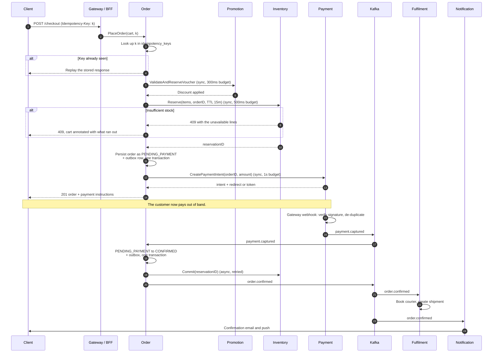

**What this says.** The checkout request does three synchronous things —
validate the voucher, reserve stock, create a payment intent — and returns.
Everything after payment is event-driven.

Three details carry most of the weight:

1. **The idempotency check is the first step, not an afterthought.** A customer
   double-tapping "Pay" on a flaky mobile connection is the single most common
   real-world cause of duplicate orders. The key is client-supplied, stored with
   the response, and replayed on a repeat (§9.3).
2. **Stock is reserved before payment, not after.** The alternative — take the
   money, then find out the item is gone — means a refund, an apology and a
   support ticket. Reserving first can leave stock briefly held by a customer who
   abandons checkout; that is what the 15-minute TTL is for, and it is the
   cheaper failure by a wide margin.
3. **`order.confirmed` is published inside the same transaction that changes the
   order's state**, via the outbox (§9.2). There is no window in which the order
   is confirmed but the event was lost.

**Latency budget for the synchronous span** (estimates, summing to the 2 s p99
SLO):

| Step | Budget |
|---|---|
| Gateway, auth, routing | 50 ms |
| Voucher validation | 300 ms |
| Inventory reservation | 500 ms |
| Order persist + outbox | 100 ms |
| Payment intent creation | 1,000 ms |
| Slack | 50 ms |

Payment intent creation is the largest single item and the one we control least.
If the gateway's p99 degrades, the circuit breaker (§11.6) opens and checkout
falls back to a "we will confirm shortly" flow rather than timing out.

---

## 6. Payment processing

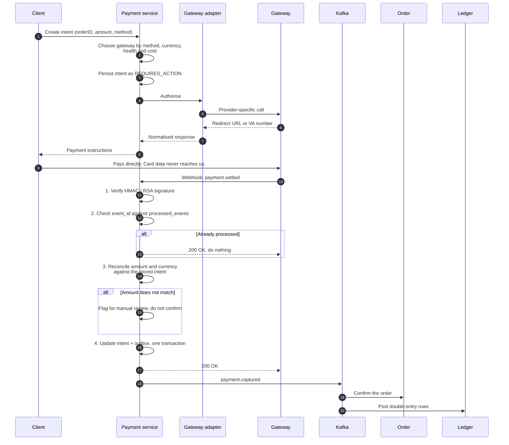

**What this says.** Four things happen to every inbound webhook, in this order,
and none may be skipped:

1. **Signature verification** against the gateway's key, with a constant-time
   comparison. An unsigned or wrongly signed callback is discarded and alerted
   on — a forged "payment succeeded" is the highest-value attack against an
   e-commerce platform, and the signature is the only thing standing in its way.
2. **De-duplication** by the gateway's own event ID, stored in a table with a
   unique constraint. Every gateway retries; several retry aggressively; at least
   one will deliver the same event days later.
3. **Amount and currency reconciliation** against the stored intent. A callback
   claiming a settled amount that does not match what we asked for is never
   auto-confirmed. This catches both integration bugs and tampering.
4. **State change and outbox row in one transaction**, so a crash after the
   database commit but before publishing is impossible.

**Multi-gateway strategy.** Each gateway sits behind an adapter implementing one
internal `PaymentGateway` interface: authorise, capture, void, refund, plus a
webhook parser. The internal model is the abstraction — gateway-specific fields
live in a JSONB `provider_details` column rather than leaking into the domain.

Routing picks a gateway by payment method, then by health, then by cost. Failing
over mid-transaction is *not* attempted: once an intent exists at one gateway,
retrying at another risks a double charge. Failover applies to the *next*
transaction, which is why the breaker's decision is per-gateway.

**PCI DSS scope.** Card data never touches our infrastructure. The client
tokenises directly with the gateway's SDK — hosted fields or a redirect — and we
store only the gateway's token. That keeps us at SAQ A rather than SAQ D, which
is the difference between an annual self-assessment questionnaire and a
qualified-assessor audit of every system that touches cardholder data. It is the
single highest-leverage compliance decision in this design, and it is why
payment is a separate service from day one.

---

## 7. Inventory reservation and overselling

This is the hardest correctness problem in the platform, so it gets the most
detail.

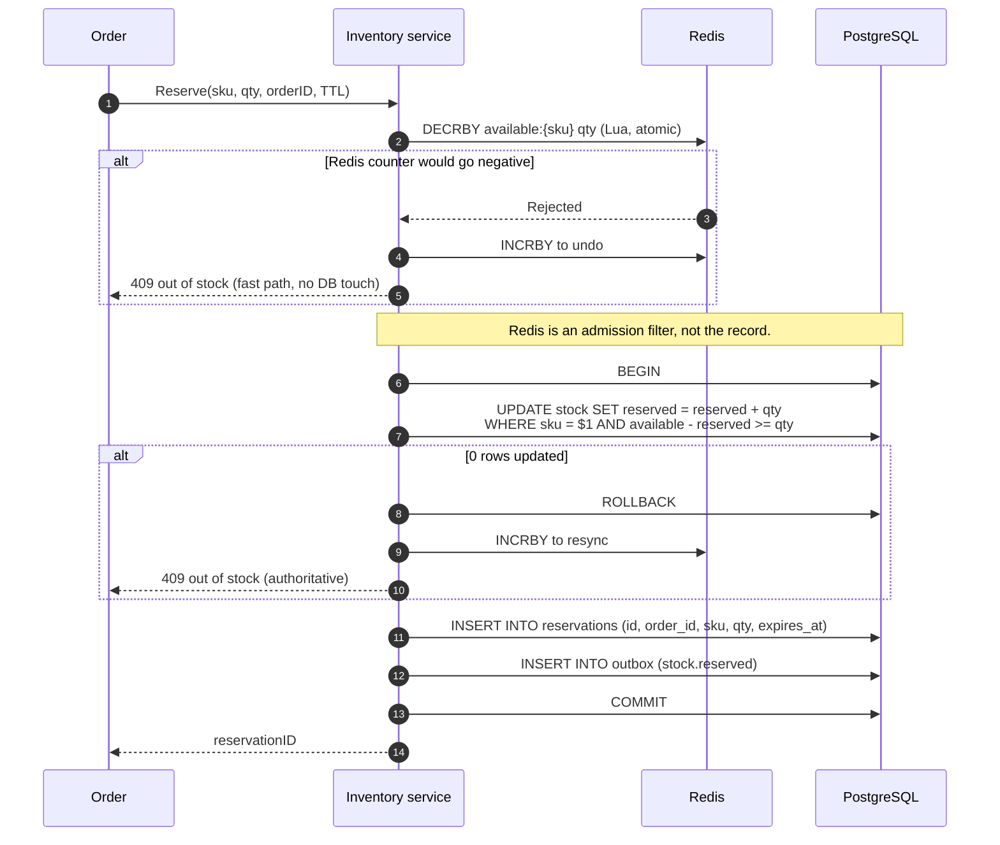

### 7.1 Why two layers

Under a flash sale, 500 orders per second converge on a handful of SKU rows.
A single PostgreSQL row cannot be updated 500 times per second — each update
serialises behind the previous row lock, and the queue grows without bound.

The two-layer design splits the problem:

- **Redis is an admission filter.** An atomic Lua `DECRBY` with a floor at zero
  rejects the 90% of requests that cannot possibly succeed, in well under a
  millisecond, without touching the database.
- **PostgreSQL is the record.** The conditional `UPDATE ... WHERE available -
  reserved >= qty` is what actually prevents overselling. Even if Redis is stale,
  wrong or entirely gone, that predicate cannot be violated.

**This is the important property: correctness never depends on Redis.** Redis
makes the system fast; the database keeps it correct. If Redis is emptied, every
request falls through to the database, throughput drops sharply, and not one
extra unit is oversold.

### 7.2 Reservation state machine

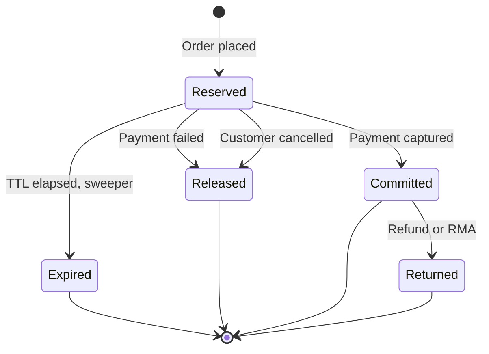

A reservation that is neither committed nor released within its TTL is reclaimed
by a sweeper running every 30 seconds:

```sql
UPDATE reservations
   SET status = 'expired'
 WHERE status = 'reserved'
   AND expires_at < now()
 RETURNING sku, qty;   -- feeds the compensating stock increment
```

Without the sweeper, an abandoned checkout holds stock forever and a flash sale
sells out to people who never paid. The sweeper is not an optimisation; it is
what makes reserve-before-payment safe.

### 7.3 Hot keys and hot products

For a SKU with thousands of contenders on one row:

- **Sharded counters.** Split a SKU's stock into N logical shards
  (`available:{sku}:{0..N-1}`), each with its own row. A reservation picks a
  shard at random and falls through to others only on failure. This turns one
  contended row into N less-contended rows, at the cost of a "spread thin"
  failure mode near sell-out — the last few units may be split across shards so
  that no single shard can satisfy a multi-unit request. Mitigation: collapse the
  shards once total remaining stock drops below a threshold.
- **Queue-based admission for announced drops.** For a scheduled launch, put
  buyers in a virtual waiting room and admit them at a rate the inventory service
  can absorb. Slower for the customer, but it converts a thundering herd into a
  bounded stream, and it is honest — a spinner that says "you are number 4,182"
  beats a checkout that times out.
- **Per-user limits** enforced at reservation time, so one script cannot take the
  whole allocation.

---

## 8. Failure and compensation — the checkout saga

The checkout spans order, inventory, payment and promotion. There is no
distributed transaction across them, and adding one (XA/2PC) would be worse: it
holds locks across network calls and turns any participant's outage into a
platform-wide stall. Instead, **the order service orchestrates a saga**, and
every step has a compensating action.

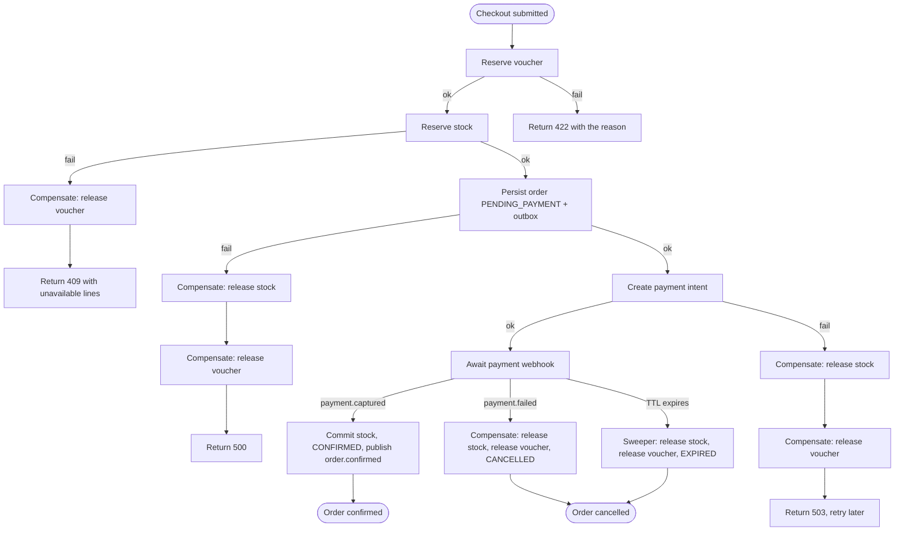

**Why orchestration rather than choreography.** In a choreographed saga each
service reacts to the previous one's event and nobody owns the whole. That is
elegant on a whiteboard and painful at 3 a.m.: when a checkout is stuck, the
answer to "what state is this order in?" is spread across four services' logs.
With an orchestrator, the order row *is* the answer, the compensation logic lives
in one place, and adding a step means editing one file. The cost is that the
order service knows about its collaborators — acceptable, because the order
service is the thing whose behaviour we most need to reason about.

**Compensations are idempotent and retried.** `ReleaseStock(reservationID)` on an
already-released reservation succeeds silently. That matters because a
compensation can itself fail and be retried, and a compensation that is not
idempotent turns one failure into corruption.

### 8.1 Named failure scenarios

The brief asks for six specific cases. Each is answered with the mechanism, not a
reassurance.

#### 8.1.1 Payment succeeds but the order service times out

**Situation.** The gateway captured the money; our confirmation path failed.

**Why it cannot lose the payment.** The capture is recorded by the *payment*
service inside a transaction that also writes an outbox row. The order service
learns about it by consuming `payment.captured` from Kafka, not by being called
synchronously. If the order service is down, the message stays in the topic and
is consumed when it recovers — consumer offsets do not advance past unprocessed
messages.

**If the order service is down for longer than the reservation TTL**, the stock
is released while the payment stands. This is the one genuinely unpleasant case,
and it is handled explicitly: on `payment.captured` for an order whose
reservation has expired, the order service re-attempts reservation. If it
succeeds, the order proceeds. If it fails, the order moves to
`PAYMENT_RECEIVED_STOCK_UNAVAILABLE`, an automatic refund is issued, and the
customer is told. Silently keeping the money is not an option, and pretending
this case cannot happen would be worse than handling it.

**Reconciliation backstop.** A job compares the gateway's settlement report
against our payments table every hour and raises any payment with no
corresponding confirmed order.

#### 8.1.2 Duplicate payment callbacks

**Situation.** The gateway delivers the same webhook two, ten or a hundred times.

**Mechanism.** Every callback carries a provider event ID. Before processing:

```sql
INSERT INTO processed_events (provider, event_id, received_at)
VALUES ($1, $2, now())
ON CONFLICT (provider, event_id) DO NOTHING;
-- 0 rows inserted means we have seen it. Return 200 and stop.
```

The insert happens **in the same transaction** as the state change. A duplicate
therefore cannot be half-processed: either the whole transaction commits once, or
it does nothing. The endpoint always answers `200` to a duplicate, because
answering with an error makes gateways retry harder.

Retention: 90 days, longer than any gateway's retry window.

#### 8.1.3 Inventory runs out during checkout

**Situation.** Stock is exhausted between adding to the cart and submitting.

**Mechanism.** The reservation in step 4 of §5 is the arbiter, and it is the only
one. Availability shown on the product page and in the cart is *advisory* — it is
cached, and it is allowed to be stale. The conditional `UPDATE` is authoritative.

The response is a `409` naming exactly which lines failed and how many are
available, so the client can show "2 of the 3 you wanted are left" rather than a
generic error. Partial fulfilment is a product decision; the API supports both
by returning per-line detail.

The voucher reserved in step 3 is released by compensation, so a failed checkout
does not consume a single-use code.

#### 8.1.4 Message broker outage

**Situation.** Kafka is unavailable.

**What keeps working.** Everything synchronous: browsing, search, cart,
reservation, order placement, payment intent creation. Orders are still written
to PostgreSQL, and **their events accumulate in each service's outbox table**.
This is the property that makes the outbox pattern worth its complexity — a
broker outage becomes a delay, not a data-loss event.

**What degrades.** Confirmation emails, search index freshness, shipment booking
and recommendation updates all stop. Customers see orders as confirmed but do not
receive email.

**Recovery.** When Kafka returns, the relay drains the outbox in order. Backlog
drain time is the outage duration times the ratio of publish rate to drain rate;
the relay is sized to drain at several times steady-state rate so an hour's
outage clears in minutes.

**Bounding it.** Alert when any outbox exceeds 10,000 unpublished rows or
5 minutes of age. If an outage runs long enough that outbox growth threatens disk,
the documented decision is to shed non-critical events (recommendation, analytics)
first and preserve order, payment and inventory events.

#### 8.1.5 Search index lag

**Situation.** OpenSearch is behind the catalogue, or unavailable.

**Why it is not a correctness problem.** Search owns no source of truth. A stale
index shows an old price or a delisted product; the product page reads from the
catalogue service and shows the truth, and the cart and checkout re-validate
price and availability before charging anyone. A customer can be *misled* by
search, but cannot be *charged* wrongly because of it.

**Handling.**
- Index writes are consumed from `product.updated` with a target lag under 5
  seconds; alert at 60 seconds.
- Search results carry an `indexed_at`; the BFF hydrates price and availability
  for the visible page from the catalogue cache, so the list a customer actually
  reads is fresh even when the index is not.
- If OpenSearch is entirely down, search degrades to browsing by category and a
  PostgreSQL trigram lookup over product names — noticeably worse, and clearly
  better than a blank page.
- The index is fully rebuildable from the catalogue in a few hours, and that
  rebuild is exercised on a schedule so it is known to work.

#### 8.1.6 Partial regional or availability-zone failure

**Situation.** One AZ is lost.

**Mechanism.**
- Kubernetes nodes span three AZs, with pod anti-affinity so no service has all
  its replicas in one zone.
- PostgreSQL runs primary plus synchronous standby in a second AZ, plus an
  asynchronous replica in a third. Automatic failover promotes the synchronous
  standby: RPO 0 for committed transactions, RTO measured in tens of seconds.
- Kafka topics use replication factor 3 with `min.insync.replicas=2`, spread
  across AZs. One AZ loss leaves the cluster writable.
- Redis Cluster keeps replicas in different AZs. A cache loss is a latency event,
  not a correctness event (§7.1).
- Capacity is provisioned at N+1 zones, so losing one AZ does not require
  emergency scaling.

**Region loss** is deliberately *not* automatic. Cross-region synchronous
replication would add tens of milliseconds to every write for a failure that may
happen once. The plan is asynchronous replication to a warm standby region,
continuous WAL archiving to object storage, and a documented, rehearsed manual
failover with an RTO of 4 hours and an RPO of about 5 minutes. Naming that
trade-off is more useful than claiming an active-active design nobody has funded.

---

## 9. Data and communication patterns

### 9.1 Synchronous or asynchronous — the rule

Synchronous when the caller **cannot proceed without the answer** and the answer
must be authoritative *now*: reserving stock, creating a payment intent,
validating a voucher, reading a product page.

Asynchronous when the work is a **consequence** rather than a prerequisite:
sending an email, indexing a document, booking a courier, updating a
recommendation model, posting to the ledger.

The test is: *if this call fails, must the user's request fail?* If not, it is an
event.

### 9.2 The transactional outbox

Writing to the database and publishing to Kafka are two systems. Doing both
without a shared transaction means a crash between them either loses the event or
publishes one for a change that rolled back. The outbox removes the gap:

```sql
CREATE TABLE outbox (
    id             BIGSERIAL PRIMARY KEY,
    aggregate_type TEXT        NOT NULL,
    aggregate_id   UUID        NOT NULL,
    event_type     TEXT        NOT NULL,
    payload        JSONB       NOT NULL,
    -- The partition key, so all events for one order stay ordered.
    partition_key  TEXT        NOT NULL,
    created_at     TIMESTAMPTZ NOT NULL DEFAULT now(),
    published_at   TIMESTAMPTZ
);

CREATE INDEX outbox_unpublished_idx
    ON outbox (id)
    WHERE published_at IS NULL;
```

The business write and the outbox insert are one transaction. A relay — Debezium
reading the WAL, or a simple polling publisher — moves rows to Kafka and marks
them published. Delivery is therefore **at-least-once**, which is why every
consumer must be idempotent (§9.3).

The partial index matters: the outbox grows to millions of rows, and the relay
only ever reads the unpublished tail. Published rows are archived after 7 days.

### 9.3 Idempotency

Three distinct mechanisms, for three distinct problems:

| Where | Key | Mechanism |
|---|---|---|
| Client to API | Client-supplied `Idempotency-Key` header | `idempotency_keys` table: unique key, stored response, 24-hour TTL. A repeat replays the stored response instead of re-executing |
| Gateway to us | Provider event ID | `processed_events` unique constraint, inserted in the same transaction as the effect (§8.1.2) |
| Kafka to consumer | Event ID in the envelope | Consumer-side `processed_events`, or a naturally idempotent write such as a state transition guarded by `WHERE status = 'expected'` |

State transitions are written as guarded updates:

```sql
UPDATE orders
   SET status = 'CONFIRMED', confirmed_at = now()
 WHERE id = $1 AND status = 'PENDING_PAYMENT';
```

Zero rows affected means someone else already did it — which is success, not an
error. This makes the whole confirmation path safe to replay.

### 9.4 Ordering, duplicates and retries

**Ordering.** Kafka guarantees order within a partition. Every event is
partitioned by its aggregate ID — `order_id` for order events, `sku` for stock
events — so all events about one order arrive in order at one consumer. There is
no global ordering, and the design does not need one; a consumer that needs to
correlate two aggregates uses the event's timestamp and version rather than
arrival order.

**Duplicates.** At-least-once delivery is assumed everywhere. See §9.3.

**Retries.** Exponential backoff with full jitter:

```
delay = random(0, min(cap, base × 2^attempt))
```

The jitter is not a nicety. Without it, every client that failed during an outage
retries at the same instant when the dependency recovers, and knocks it over
again. Base 100 ms, cap 30 s, 5 attempts for synchronous calls; longer and more
patient for consumers.

Only idempotent operations are retried. A non-idempotent call that times out is
escalated, not repeated.

**Dead letters.** After the retry budget, the message goes to
`<topic>.dlq` with the original payload, the error and the attempt count. DLQs
are monitored, and a non-empty DLQ pages someone — a silently accumulating DLQ is
just data loss with extra steps. Replay is a deliberate operator action after the
cause is fixed.

### 9.5 Order state machine

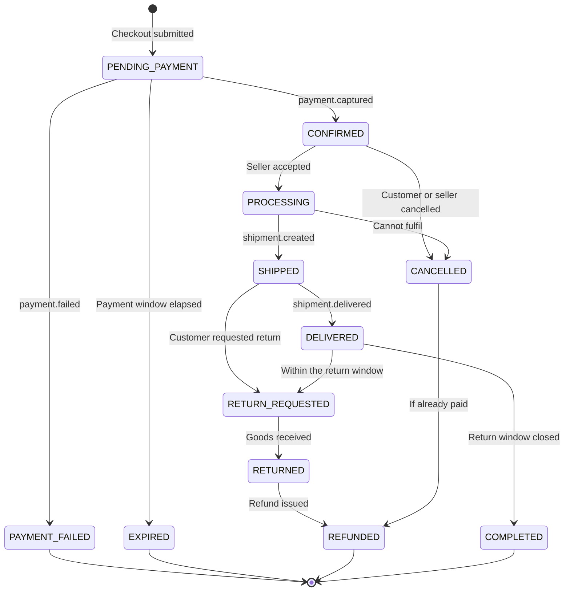

The transition table is data, not scattered `if` statements, and every attempted
transition is validated against it. Illegal transitions are rejected and alerted
on rather than silently ignored — an order that reaches an impossible state is a
bug worth waking up for. Each transition writes an `order_events` row, which is
both the customer-facing tracking timeline and the audit trail.

### 9.6 Search indexing

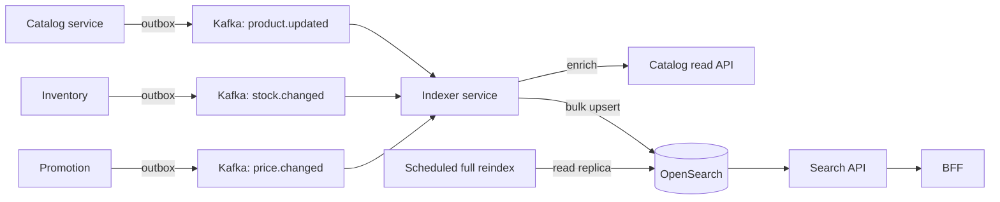

One indexer consumes from three topics, enriches, and bulk-upserts on a short
interval — batching an order of magnitude fewer, larger requests at OpenSearch
than one write per event.

Availability is indexed as a coarse flag (`in_stock`), not an exact count.
Indexing exact counts would mean re-indexing a document on every reservation
during a flash sale — thousands of writes per second for a number the customer
does not need. Exact availability comes from the product page.

A full rebuild writes to a new index and swaps an alias atomically, so a rebuild
never leaves search half-populated.

### 9.7 Recommendation data flow

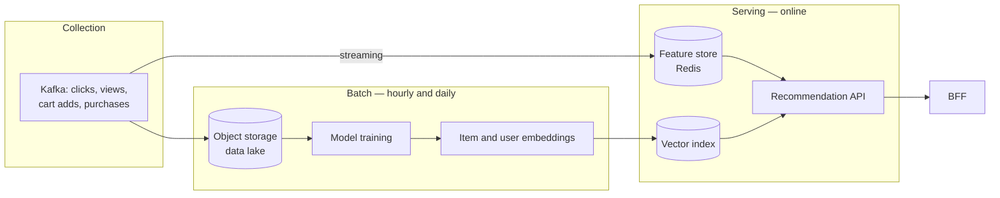

Models are trained in batch; serving is online. Real-time signals — what you
looked at in the last five minutes — go straight to the feature store so the
session influences results without waiting for a retrain.

Recommendations are a **best-effort enhancement**. If the service is down or
slow, the BFF drops the block after a 100 ms budget and renders a
merchandised fallback. No page ever waits on a recommendation, and no checkout
depends on one.

---

## 10. Data design

### 10.1 Ownership

| Store | Owner | Contents | Scaling |
|---|---|---|---|
| PostgreSQL — identity | Identity | Accounts, credentials, sessions, addresses | Vertical + read replicas |
| PostgreSQL — catalog | Catalog | Products, SKUs, attributes, categories | Read replicas; heavy read caching |
| PostgreSQL — order | Order | Orders, lines, events, idempotency keys | Partitioned by month; archived after 24 months |
| PostgreSQL — inventory | Inventory | Stock, reservations, ledger | Vertical first, then shard by SKU |
| PostgreSQL — payment | Payment | Intents, transactions, refunds, processed events | Vertical; strict retention |
| PostgreSQL — fulfilment | Fulfilment | Shipments, tracking | Partitioned by month |
| Redis Cluster | Shared, namespaced | Sessions, cart, product cache, stock counters, rate limits | Horizontal by hash slot |
| OpenSearch | Search | Product index | Shards + replicas |
| Object storage | Catalog, analytics | Images, exports, the data lake | Effectively unbounded |
| Kafka | Platform | Domain events, 7-day retention | Partitions |

### 10.2 Key entities

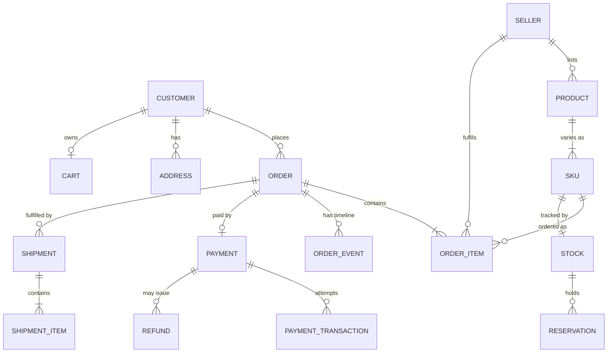

Design decisions worth defending:

- **Order items store a price snapshot**, not a foreign key to the current price.
  An order is a historical fact. If a product's price changes, last month's
  invoice must not change with it.
- **Money is stored as `BIGINT` minor units plus an ISO-4217 currency code.**
  Never floating point. `NUMERIC` would also be correct, but integer cents are
  unambiguous across every language that touches the data.
- **Stock is a separate table from SKU**, because its write pattern is completely
  different: SKUs are written rarely, stock is written thousands of times a
  second, and mixing them puts catalogue reads behind inventory row locks.
- **`order_events` is append-only.** It serves as the customer's tracking
  timeline and the audit trail, and it means order state is reconstructible even
  if the `status` column is ever corrupted.
- **Sellers are on order *items*, not on orders.** A marketplace basket routinely
  spans sellers, and each line is fulfilled and settled separately.

### 10.3 Partitioning

| Table | Strategy | Reason |
|---|---|---|
| `orders`, `order_items` | Range by `created_at`, monthly | Queries are recent-first; old partitions detach and archive cheaply |
| `order_events` | Range by `created_at`, monthly | Highest-volume table; follows its parent |
| `outbox` | Range by `created_at`, weekly | Drop the whole partition once drained — no `DELETE`, no bloat, no vacuum storm |
| `stock`, `reservations` | Hash by `sku_id` when one node is no longer enough | Distributes hot rows |
| `payment_transactions` | Range by `created_at`, monthly | Retention and audit boundaries align with months |

### 10.4 Caching

| Cache | Key | TTL | Invalidation |
|---|---|---|---|
| Product detail | `product:{id}` | 5 min | Event-driven delete on `product.updated` |
| Category listing | `cat:{id}:{page}:{sort}` | 1 min | TTL only; a minute of staleness is acceptable here |
| Stock availability (advisory) | `available:{sku}` | No TTL | Written by the inventory service, authoritative check still in PostgreSQL |
| Session | `session:{id}` | Session length | Deleted on logout |
| Cart | `cart:{id}` | 30 days | Written through |
| Search results | `search:{hash(query)}` | 30 s | TTL only |

Reads are cache-aside. Writes to product data publish an event that deletes the
key rather than updating it: a delete is idempotent and order-independent, while
two concurrent updates can leave the cache holding the older value.

**Stampede protection.** A popular key expiring under load sends every concurrent
request to the database at once. Two defences: a short per-key lock so exactly
one request recomputes while the others wait briefly, and early probabilistic
refresh so a hot key is renewed just before it expires rather than exactly at
expiry.

### 10.5 What a customer sees during eventual consistency

Worth stating explicitly, because "eventually consistent" is often where designs
stop and product problems begin:

| Gap | Window | What the customer sees |
|---|---|---|
| Order placed to confirmation email | < 10 s typical | Order visible immediately in "my orders"; email arrives shortly |
| Product published to searchable | < 5 s typical | Direct link works immediately; search finds it moments later |
| Stock decremented to search flag updated | < 30 s | Search may show an item as in stock that is not; the product page corrects it |
| Payment captured to order confirmed | < 5 s | "Payment received, confirming your order" |

Each of these has a UI state, so the interface is never lying — only briefly
behind, and saying so.

---

## 11. Scalability and reliability

### 11.1 Horizontal scaling

Every service is stateless and scales horizontally. Session and cart state live
in Redis, not in process memory, so any replica can serve any request and a pod
can be evicted at any time.

| Service | Baseline | Peak | Scaling signal |
|---|---|---|---|
| BFF / Gateway | 6 | 40 | RPS per pod |
| Catalog | 6 | 30 | CPU, p95 latency |
| Cart | 4 | 20 | RPS |
| Order | 6 | 40 | Checkout queue depth |
| Inventory | 6 | 30 | Reservation latency p99 |
| Payment | 4 | 15 | Intent creation rate |
| Search | 4 | 20 | Query latency |
| Consumers | 4 | 20 | Kafka consumer lag |

Consumers scale on **lag**, not CPU: a consumer can be perfectly idle on CPU and
hours behind on messages, and lag is the number that reflects customer impact.
Kafka partition count bounds consumer parallelism, so partitions are provisioned
for the peak from the start — increasing them later rebalances keys and
temporarily breaks per-key ordering.

### 11.2 Load balancing

Layer 4 at the cloud load balancer, layer 7 at the ingress. Round-robin with
outlier ejection; least-request for the inventory service, whose per-request cost
varies most. Health checks use `/readyz` so a pod that cannot reach its database
leaves the rotation without being restarted — the same distinction the blog API
implements and for the same reason.

### 11.3 Database scaling, in order

1. **Indexes and query shape.** Cheapest and usually largest win.
2. **Connection pooling** with PgBouncer in transaction mode. Hundreds of pods
   each holding a pool will exhaust `max_connections` long before CPU matters.
3. **Read replicas** for catalogue and order history. Replica lag is monitored,
   and reads that must be read-your-writes go to the primary — a customer must
   see their own order immediately after placing it.
4. **Vertical scaling.** Unglamorous and effective; a large managed instance
   handles a great deal.
5. **Partitioning** (§10.3).
6. **Sharding**, only for inventory and only when a single node genuinely cannot
   keep up. Sharding is last because it makes every cross-shard query and every
   migration harder, permanently.

### 11.4 Backpressure

Load shedding is layered so the outermost, cheapest layer sheds first:

1. CDN and WAF absorb static and abusive traffic.
2. Gateway rate limits by API key, user and IP.
3. Per-service concurrency limits reject beyond a bounded in-flight count rather
   than queueing without limit — an unbounded queue converts a throughput problem
   into a latency problem and then into an out-of-memory kill.
4. Bounded worker pools with non-blocking submission internally. (The blog API in
   this submission implements exactly this pattern in
   `internal/platform/events`.)
5. Virtual waiting room for announced flash sales.

When shedding, non-essential work goes first: recommendations, then search
personalisation, then analytics. Checkout is shed last, and if it must be shed,
the message says so honestly rather than timing out.

### 11.5 Rate limiting

| Scope | Limit | Implementation |
|---|---|---|
| Anonymous browse | 100 req/min per IP | Gateway, sliding window in Redis |
| Authenticated browse | 600 req/min per user | Gateway |
| Login | 5 attempts / 15 min per account, plus per-IP | Identity, with progressive delay |
| Checkout | 10 / hour per user | Order service |
| Payment callbacks | Per-gateway allowlist, generous limit | Payment service |
| Search | 60 / min per user | Gateway |

Cluster-wide limits use a Redis token bucket in a Lua script — one round trip,
atomic. The in-process limiter in the blog API is the same algorithm without the
shared state; the trade-off is written up in `docs/architecture-decisions.md`
(ADR-008).

### 11.6 Circuit breakers, timeouts, bulkheads

**Timeouts everywhere**, with the caller's budget always shorter than the
callee's, so a deadline fires at the layer that can still respond usefully:

| Call | Timeout |
|---|---|
| Gateway to service | 3 s |
| Service to service | 1 s |
| Service to PostgreSQL | 500 ms typical, 2 s for reports |
| Service to Redis | 50 ms |
| Service to payment gateway | 10 s |
| Service to courier API | 5 s |

**Circuit breakers** on every external dependency: open at a 50% failure rate over
20 requests, half-open after 30 seconds, close after 5 consecutive successes.
Each has a defined fallback — a failing gateway is removed from routing for new
intents; a failing courier queues the booking for retry; a failing fraud service
falls back to a rules-only score.

**Bulkheads.** Separate connection pools and worker pools per dependency, so a
slow courier API cannot consume every worker and starve checkout. Separate
Kubernetes node pools for latency-sensitive services and batch work.

### 11.7 Observability

- **Metrics.** Prometheus, RED per service (rate, errors, duration) and USE per
  resource. Business metrics alongside: orders per minute, checkout conversion,
  payment success rate by gateway, reservation failure rate. A payment success
  rate falling from 97% to 89% is an incident that CPU graphs will never show.
- **Tracing.** OpenTelemetry end to end, with trace context propagated across
  Kafka via message headers so an asynchronous flow is one trace, not five.
  Tail-based sampling: keep everything that errored or ran slowly, sample the
  rest at 1%.
- **Logging.** Structured JSON to Loki, correlated by trace ID. No PII, no card
  data, no tokens — enforced by a redacting handler, not by reviewer discipline.
  (Again, implemented in this submission's `internal/platform/logging`.)
- **Alerting on symptoms, not causes.** Page on "checkout success rate below
  99%", not on "CPU above 80%". Alerts map to error budgets so a pager only fires
  when customers are actually affected.

### 11.8 Backup and recovery

| Asset | Method | Frequency | Retention | Tested |
|---|---|---|---|---|
| PostgreSQL | Full snapshot + continuous WAL archiving | Daily + continuous | 35 days | Monthly restore drill |
| Kafka | Topic replication ×3 + tiered storage | Continuous | 7 days | Quarterly |
| OpenSearch | Snapshots, plus full rebuild from source | Daily | 7 days | Quarterly rebuild |
| Object storage | Cross-region replication, versioned | Continuous | Indefinite | Quarterly |
| Secrets | Vault snapshots, encrypted | Daily | 90 days | Quarterly |

Point-in-time recovery to any second within 35 days. A backup that has never been
restored is a hypothesis, so the restore drill is scheduled and its duration is
recorded — that recorded duration is the real RTO, not the aspirational one.

---

## 12. Security and compliance

### 12.1 Authentication and authorisation

- Customers: OIDC-style flow, short-lived access JWT (15 min), rotating refresh
  token stored hashed and revocable. Same design as the blog API in this
  submission, and for the same reasons.
- Sellers and staff: SSO with mandatory MFA.
- Authorisation is RBAC with per-resource ownership checks. The gateway verifies
  the token's signature and expiry; **each service still re-checks
  authorisation**, because a gateway bypass or an internal caller must not be
  able to skip it. Defence in depth, not delegation.
- Service-to-service: mutual TLS through the service mesh, plus short-lived
  workload identity tokens. Network policies default-deny; each service may reach
  only its declared dependencies.

### 12.2 Encryption

- In transit: TLS 1.3 at the edge, mTLS between services, TLS to every database
  and to Kafka.
- At rest: volume encryption everywhere; column-level encryption for the few
  fields that need it (national ID for KYC, bank account numbers for seller
  payouts), with keys in a KMS and envelope encryption.
- Keys rotated annually, or immediately on suspected compromise.

### 12.3 Secret management

No secret in an image, in an environment variable committed to git, or in a
config map. Secrets live in Vault or the cloud secret manager, are injected at
runtime, are rotated on a schedule, and are audit-logged on access. Database
credentials are short-lived and issued dynamically where the driver supports it.

### 12.4 PCI DSS scope reduction

The core decision, restated because it is the one that matters: **card data never
touches our systems.** Tokenisation happens client-side against the gateway's
hosted fields or SDK; we store a gateway token and the last four digits.

That keeps us at **SAQ A** — a self-assessment questionnaire — rather than SAQ D,
which would put every server, network segment and log store that could touch
cardholder data into an annual qualified-assessor audit. The engineering cost of
the alternative is not primarily technical; it is the ongoing organisational cost
of auditing everything in scope, forever.

Supporting controls: the payment service is network-isolated, its logs are
segregated with restricted access, and payloads are scanned in CI for anything
resembling a PAN.

### 12.5 PII protection

- Data inventory: what personal data exists, where it lives, why, and for how
  long. Reviewed rather than written once.
- Minimisation: fields are collected only where there is a stated purpose.
- Access: role-gated, audit-logged, alerting on bulk reads.
- Right to erasure: personal data is deleted or anonymised; **financial records
  are retained**, because tax law requires it. Order rows survive with the
  customer reference anonymised. This tension is real, and the resolution is
  written down rather than discovered during a request.
- Logs and traces are scrubbed at the handler.

### 12.6 Fraud and abuse

- Velocity checks: orders per card, per device, per address per hour.
- Device fingerprinting and IP reputation.
- Third-party fraud scoring on the checkout path, with a rules-only fallback when
  the breaker is open — an unavailable fraud service must not block all revenue.
- Manual review queue for high-value or high-risk orders.
- Bot defences on login, checkout and voucher redemption.

### 12.7 Audit logging

Append-only, tamper-evident (hash-chained), separate from application logs, and
retained for 7 years. Covers authentication events, authorisation failures, order
and payment state changes, refunds, price and stock adjustments, and every
administrative action. Written by the same outbox mechanism as domain events, so
an audit entry cannot be lost by a crash between the change and the log.

### 12.8 Data retention

| Data | Retention | Driver |
|---|---|---|
| Order and payment records | 10 years | Indonesian tax and accounting law |
| Customer PII | Life of account + 30 days | Privacy minimisation |
| Application logs | 30 days hot, 1 year cold | Cost and incident forensics |
| Audit logs | 7 years | Compliance |
| Analytics events | 2 years, pseudonymised after 90 days | Modelling versus privacy |
| Kafka topics | 7 days | Replay window |

---

## 13. Technology stack

| Layer | Choice | Why this, and what was rejected |
|---|---|---|
| Service language | **Go** | Small memory footprint per replica, fast start-up (matters when autoscaling), first-class concurrency, static binaries in tiny images. Rejected: Java — heavier and slower to start; Node — weaker for CPU-bound work |
| ML services | **Python** | The ecosystem is where the models are. Using Go here would be ideology over outcome |
| Storefront | **Next.js** | SSR and ISR for SEO-critical product pages; a SPA loses organic traffic |
| API style | **REST + JSON** externally, **gRPC** internally | REST for reach and cacheability; gRPC internally for typed contracts and lower overhead. GraphQL rejected for now: the BFF already solves over-fetching, and GraphQL's caching and rate-limiting story is a real cost |
| Gateway | **Envoy / Kong** | Mature, observable, extensible |
| Primary datastore | **PostgreSQL 16** | Genuine ACID, rich indexing, JSONB where flexibility is needed, mature operational tooling. This design leans on transactional guarantees repeatedly; a document store would push that work into application code |
| Cache and hot counters | **Redis Cluster** | Sub-millisecond, atomic Lua for the inventory admission filter, cluster mode for horizontal scale |
| Event platform | **Kafka** | Durable ordered log with replay. The replay property is what makes the outbox and DLQ designs work. RabbitMQ rejected: excellent broker, but not a replayable log |
| Search | **OpenSearch** | Full-text, faceting, relevance tuning, aggregations. PostgreSQL FTS is genuinely good — and is what the blog API in this submission uses — but does not carry 5M documents with faceted navigation |
| Object storage | **S3-compatible** | Cheap, durable, CDN-friendly |
| Orchestration | **Kubernetes** | Autoscaling, rollouts, self-healing, multi-AZ scheduling |
| Service mesh | **Istio or Linkerd** | mTLS, retries, circuit breaking and telemetry without library sprawl. Adopt in phase 2 — a mesh on day one is complexity before the problem |
| CI/CD | **GitHub Actions + Argo CD** | GitOps: the cluster's state is a reviewable diff |
| Observability | **Prometheus, Grafana, Loki, Tempo, OpenTelemetry** | Open standards, no vendor lock-in on instrumentation |
| Secrets | **Vault** or cloud KMS | Dynamic credentials, rotation, audited access |
| IaC | **Terraform** | Reproducible infrastructure, reviewable changes |

The stack leans on Go, PostgreSQL, Redis, Kafka, Kubernetes and OpenTelemetry
because those are where this candidate's depth is and, independently, because
they fit the problem. Python for ML and OpenSearch for search are cases where
forcing the familiar choice would be the wrong call, and are noted as such.

---

## 14. Deployment and observability view

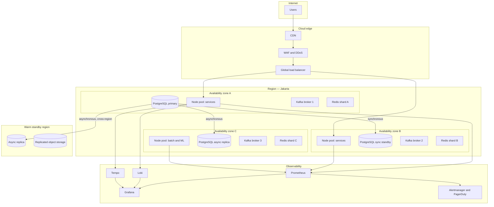

**Deployment.** Rolling updates by default, with readiness gates and automatic
rollback on SLO regression. Blue-green for the payment service, whose blast
radius justifies the extra infrastructure. Database migrations are backwards
compatible and applied in the expand–migrate–contract order, so a rollback never
requires a schema rollback — the same discipline the blog API's migration runner
enforces with checksums.

**Observability.** Two Grafana dashboards matter most: a business view (orders
per minute, conversion, payment success by gateway, checkout error rate) and a
platform view (RED per service, consumer lag, database saturation, breaker
state). The business dashboard is the one that goes on the wall, because it is
the one that notices an outage the platform metrics call healthy.

---

## 15. API specification outline

External REST, versioned at `/api/v1`, JSON, bearer tokens, the same envelope and
error-code contract implemented in Part 1 of this submission.

```
Identity
  POST   /api/v1/auth/register
  POST   /api/v1/auth/login
  POST   /api/v1/auth/refresh
  POST   /api/v1/auth/logout
  GET    /api/v1/users/me
  PATCH  /api/v1/users/me
  GET    /api/v1/users/me/addresses
  POST   /api/v1/users/me/addresses

Catalog
  GET    /api/v1/products?category=&seller=&page=&limit=
  GET    /api/v1/products/{productID}
  GET    /api/v1/products/{productID}/skus
  GET    /api/v1/categories

Search
  GET    /api/v1/search?q=&filters=&sort=&page=
  GET    /api/v1/search/suggest?q=

Cart
  GET    /api/v1/cart
  POST   /api/v1/cart/items
  PATCH  /api/v1/cart/items/{itemID}
  DELETE /api/v1/cart/items/{itemID}
  POST   /api/v1/cart/voucher

Checkout and orders
  POST   /api/v1/checkout                 (Idempotency-Key required)
  GET    /api/v1/orders?status=&page=
  GET    /api/v1/orders/{orderID}
  GET    /api/v1/orders/{orderID}/events  (tracking timeline)
  POST   /api/v1/orders/{orderID}/cancel  (Idempotency-Key required)
  POST   /api/v1/orders/{orderID}/return

Payments
  GET    /api/v1/payments/{paymentID}
  POST   /api/v1/payments/{paymentID}/retry
  POST   /internal/webhooks/payments/{provider}   (signature-verified, not public)

Inventory — internal
  POST   /internal/v1/inventory/reserve
  POST   /internal/v1/inventory/commit
  POST   /internal/v1/inventory/release
  GET    /internal/v1/inventory/availability?skus=

Recommendations
  GET    /api/v1/recommendations/home
  GET    /api/v1/recommendations/products/{productID}/similar
```

Conventions that apply to all of it: `Idempotency-Key` is **required** on every
state-changing checkout or payment operation; list endpoints use cursor
pagination (offset pagination is fine for a blog and wrong for a marketplace
feed, for the reasons set out in `docs/social-media-database-design.md` §5);
every response carries `X-Request-Id`; errors use the stable-code envelope.

---

## 16. Key trade-offs

| Decision | Chosen | Alternative | Why, and what it costs |
|---|---|---|---|
| Transaction model across services | Saga with compensations | Two-phase commit | 2PC holds locks across network calls and turns any participant's outage into a platform stall. **Cost:** intermediate states are visible, and every step needs a compensating action |
| Saga style | Orchestration | Choreography | The order row answers "what state is this in?" **Cost:** the order service knows its collaborators |
| Reservation timing | Before payment | After payment | Taking money for stock we do not have is far worse. **Cost:** a TTL sweeper, and stock briefly held by abandoners |
| Inventory correctness | PostgreSQL conditional update | Redis counter alone | Redis can be stale, evicted or lost. **Cost:** the database is in the hot path for the requests that pass the filter |
| Event delivery | At-least-once + idempotent consumers | Exactly-once | Exactly-once across heterogeneous systems is largely a story. **Cost:** every consumer must be idempotent, deliberately |
| Search index freshness | Eventually consistent, coarse stock flag | Synchronous indexing | Synchronous indexing puts OpenSearch's availability in the checkout path. **Cost:** search can briefly mislead; the product page corrects it |
| Service granularity | Modular monolith, extract under pressure | Microservices from day one | Thirteen pipelines before product-market fit is self-inflicted. **Cost:** module boundaries need discipline to stay real |
| PCI scope | Client-side tokenisation, SAQ A | Server-side card handling | SAQ D would put the whole platform under audit. **Cost:** dependent on gateway SDKs, less control over the payment UI |
| Multi-region | Warm standby, manual failover | Active-active | Cross-region synchronous writes cost tens of milliseconds on every order for a rare failure. **Cost:** 4-hour RTO, ~5-minute RPO on region loss |
| Internal transport | gRPC | REST everywhere | Typed contracts and lower overhead internally. **Cost:** tooling and debugging are less immediate than curl |

---

## 17. Alternatives considered and rejected

**Event sourcing for orders.** A perfect audit trail and time travel — and a
steep learning curve, awkward queries, and painful schema evolution for a team
that has not done it before. `order_events` gives most of the audit benefit at a
fraction of the cost. Revisit if regulators demand full reconstruction.

**CQRS with separate read models everywhere.** Justified for search, which
already has one. Applying it uniformly would double the number of stores to keep
consistent for endpoints that a read replica serves adequately.

**Kubernetes Operators for everything.** Managed PostgreSQL, Kafka and
OpenSearch cost more per month and far less in engineer-hours. Running our own
would mean owning backup, failover and upgrade automation for three stateful
systems. Not a good trade for a team this size.

**GraphQL as the public API.** Solves over-fetching, which the BFF already
solves; brings caching, rate-limiting and query-cost problems that REST does not
have. Reconsider if third-party API consumers with diverse needs appear.

**NoSQL as the primary store.** The design depends on transactional guarantees in
several places — the outbox, reservations, saga state. A document store pushes
that work into application code, where it is harder to get right and impossible
to enforce.

**Serverless for the API tier.** Attractive for spiky traffic; poor for
connection-pool-bound workloads and cold starts on a checkout path. Reasonable
for image processing and scheduled jobs, and used there.

---

## 18. Phased evolution

### Phase 1 — Launch (months 0–6)

Five deployables: the modular monolith, inventory, payment, search,
recommendation.

- Single region, multi-AZ. Managed PostgreSQL with a synchronous standby.
- Kafka with the outbox pattern in place **from day one** — retrofitting it later
  means auditing every write path for lost events.
- Redis for cache, sessions and cart.
- OpenSearch with an event-driven indexer.
- One payment gateway integrated behind the multi-gateway interface, so the
  second is a new adapter rather than a refactor.
- Full observability from the start: metrics, traces, structured logs. This is
  not a phase-2 item; a system without instrumentation cannot be scaled with
  confidence.

*Target: 1,000 concurrent users, 5,000 orders per day.*

### Phase 2 — Scale (months 6–18)

- Extract catalog and identity as pressure appears.
- Read replicas; PgBouncer in front of every database.
- Second and third payment gateways.
- Redis-backed distributed rate limiting.
- Service mesh for mTLS and uniform retry policy.
- Sharded inventory counters and the virtual waiting room for flash sales.
- Recommendation moves from batch to real-time features.

*Target: 10,000 concurrent users, 50,000 orders per day — the brief's requirement.*

### Phase 3 — Optimise (months 18–36)

- Partition orders and events by month; archive to object storage.
- Shard inventory by SKU if a single node is genuinely saturated.
- Warm standby region with rehearsed failover.
- ML-driven personalisation, dynamic pricing, demand forecasting.
- Extract fulfilment and promotion if their release cadence demands it.

*Target: 100,000 concurrent peak, 500,000 orders per day.*

### What is deliberately not planned

Active-active multi-region, a custom service mesh, event sourcing, and a
self-hosted Kafka cluster. Each is a real capability with a real cost, and none
is justified by the requirements as stated. Listing them here is the point:
these are decisions deferred with reasons, not gaps.

---

## 19. Summary

The design rests on four decisions:

1. **The database, not the cache, prevents overselling.** Redis makes inventory
   fast; a conditional `UPDATE` makes it correct. Losing Redis costs throughput,
   never accuracy.
2. **The transactional outbox removes the gap between committing and
   publishing.** It is what makes a broker outage a delay instead of a data-loss
   event, and it is why it ships in phase 1 rather than later.
3. **An orchestrated saga with idempotent compensations** replaces distributed
   transactions. The order row is always the answer to "what happened", and every
   step knows how to undo itself.
4. **Card data never touches our infrastructure**, which keeps PCI scope at SAQ A
   and is the reason payment is a separate service from the first day.

Everything else — the service split, the caching, the phasing — follows from
starting simple and extracting under measured pressure rather than in
anticipation of it.
