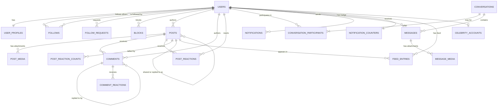
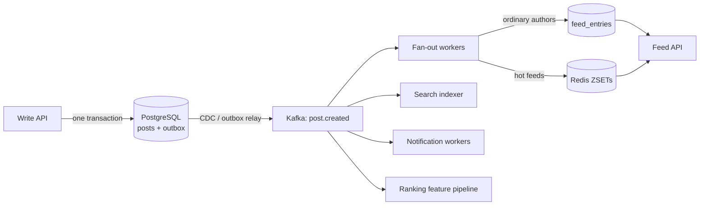

# Social Media Platform — Database Design

**Assessment section 3 — Database Design & Optimization**
Author: Benyamin Pravalent Siregar · Target role: Software Architect Engineer, Majoo Indonesia

---

## 0. Deliverables and verification

| Artefact | File |
|---|---|
| Normalised schema, constraints, triggers | [`database-assessment/schema.sql`](../database-assessment/schema.sql) |
| Index design with per-index rationale | [`database-assessment/indexes.sql`](../database-assessment/indexes.sql) |
| Complex queries, EXPLAIN guidance | [`database-assessment/queries.sql`](../database-assessment/queries.sql) |
| Generated seed data | [`database-assessment/seed.sql`](../database-assessment/seed.sql) |
| Verification harness | [`scripts/verify-sql.mjs`](../scripts/verify-sql.mjs) |
| This document | you are here |

### What was actually executed

Everything in this section was run against a real PostgreSQL engine —
PostgreSQL 18.3, executed as WebAssembly through PGlite 0.5.8, which is the
genuine Postgres source including its planner and constraint machinery, not a
simulator.

```
node scripts/verify-sql.mjs
```

The run applies the schema, indexes and seed (300 users, 5,417 follow edges,
2,634 posts, 7,296 comments, 13,170 reactions, 1,800 messages, 2,353
notifications, 10,613 materialised feed rows), then:

- executes **all 22 statements** in `queries.sql` with bound parameters — all
  succeed;
- checks **7 trigger-maintained counters** against the rows they count — no
  drift;
- confirms the database **rejects 11 invalid writes**, one per documented edge
  case;
- prints EXPLAIN plans for the five queries whose plan is claimed.

**Four real defects were found this way and fixed.** They are listed in §8,
because a design document that only records what went right is not evidence of
much.

### What is not claimed

No timing figures appear anywhere in this section. The seed volumes are small
and PGlite is a single-connection WebAssembly build; a millisecond count taken
from it would say nothing about production and would be worse than no number at
all. What was verified is *plan shape* and *index choice* — which is what the
index design actually controls.

---

## 1. Requirements and the decisions they force

| Requirement | Principal design response |
|---|---|
| User profiles | `users` (hot, narrow) split from `user_profiles` (cold, wide) |
| Followers / following | `follows` as a directed edge with a composite primary key |
| Posts with multimedia | `posts` plus `post_media`, one row per attachment, explicitly ordered |
| Comments and reactions | `comments` with a materialised path; separate reaction tables per target |
| Private messaging | `conversations` / `conversation_participants` / `messages`, with a per-conversation sequence |
| Activity feeds | Hybrid fan-out: `feed_entries` on write for ordinary accounts, read-time merge for celebrities |
| Notifications | Aggregated rows with a `dedup_key`, plus a per-user unread counter |

### Working assumptions

Labelled, because the design is only correct relative to them:

| # | Assumption |
|---|---|
| A1 | Read-heavy, roughly 100:1. Feed and profile reads dominate everything else |
| A2 | The follow graph is heavily skewed: most accounts have hundreds of followers, a handful have millions |
| A3 | Chronological feed first; ranking is a later addition, and the schema leaves room for it |
| A4 | PostgreSQL 16+, one primary with read replicas; sharding is a later phase |
| A5 | Redis is available for caching and counters, but the database must remain correct without it |
| A6 | Soft delete for user-visible content; hard delete reserved for genuine erasure requests |

---

## 2. Entity relationships



### Cardinalities and delete behaviour

Delete behaviour is chosen per relationship. Defaulting everything to `CASCADE`
is how a schema quietly acquires the ability to erase other people's data.

| Relationship | Cardinality | On delete | Why |
|---|---|---|---|
| users → user_profiles | 1 : 1 | CASCADE | A profile has no meaning without its account |
| users → follows | 1 : N both ways | CASCADE | Edges to a deleted account are meaningless |
| users → posts | 1 : N | CASCADE | Erasure must remove authored content |
| posts → post_media | 1 : N | CASCADE | An attachment cannot outlive its post |
| posts → comments | 1 : N | CASCADE | A thread cannot outlive its post |
| comments → comments (parent) | 1 : N | CASCADE, composite | Replies go with their parent — **and the composite key forces them onto the same post** |
| **posts → posts (share)** | 1 : N | **SET NULL** | **Deleting an original must not delete everyone else's commentary on it** |
| **users → messages (sender)** | 1 : N | **SET NULL** | **The other participant must still be able to read the conversation** |
| conversations → messages | 1 : N | CASCADE | Messages have no meaning outside their conversation |
| conversations → last_message | 1 : 0..1 | SET NULL | Deleting the newest message must not delete the conversation |
| users → notifications | 1 : N | CASCADE | Notifications are personal |
| users → feed_entries | 1 : N | CASCADE | A feed is a per-user cache |

The two SET NULLs are the interesting ones. Both encode the same principle:
**a user's deletion may remove their own content, never someone else's.**

---

## 3. Schema decisions worth defending

### 3.1 Splitting `users` from `user_profiles`

`users` is touched on nearly every request — authentication, authorship
resolution, counters. `user_profiles` holds `bio`, `avatar_url`, `header_url`,
`location`, read only when someone opens a profile.

Keeping the wide, rarely-read columns out of the hot table means more rows of
`users` fit in each 8 KB page, so more of the hot working set stays in cache.
The cost is a join on the profile view — a primary-key lookup, and the plan
confirms it: `Index Scan using user_profiles_pkey`, three buffers.

This is normalisation with a performance reason, not normalisation for its own
sake. It is the one vertical split in the schema; splitting anything else would
add joins without a corresponding gain.

### 3.2 Denormalised counters, maintained by trigger

`users.follower_count`, `posts.reaction_count`, `posts.comment_count` and the
per-kind tallies in `post_reaction_counts` all duplicate information that could
be derived with `COUNT(*)`.

They exist because deriving them is not a per-request operation. A profile with
1.2M followers would scan 1.2M index entries to render one number, on every view.

They are maintained by **triggers**, inside the same transaction as the row they
count, rather than by application code. The trade-off is explicit:

**For triggers**
- Impossible to forget. Every write path — the API, an import job, a manual
  `psql` fix during an incident — maintains them, because the database does it.
- Atomic with the change, so a crash cannot leave a counter half-updated.

**Against triggers**
- Invisible at the call site. A developer reading the `INSERT` sees no hint that
  three other rows will change.
- Every counter update takes a row lock on the parent, so concurrent writers to
  the same hot post serialise. §6.7 covers moving the hottest counters to Redis.

The verification run confirms all seven counters agree with their sources after
2,634 posts, 13,170 reactions and 7,296 comments — **zero drift**. And
`queries.sql` §6c is a standing reconciliation query, because a denormalised
counter with no way to check it is a counter nobody can trust.

### 3.3 Materialised path for comment threads

`comments` carries both `parent_id` (adjacency) and `path` (a materialised
path): dot-separated, zero-padded sibling positions, so `'0001.0003.0002'` is
the second reply to the third reply to the first top-level comment.

Lexicographic order over `path` is exactly thread reading order. One index scan
returns a whole thread, correctly ordered, with no recursion and no sort.

| Approach | Read a thread | Insert | Move a subtree |
|---|---|---|---|
| Adjacency only | Recursive CTE, re-walked every read | Trivial | Trivial |
| **Materialised path** | **One ordered index range scan** | Compute the path | Rewrite the subtree's paths |
| Closure table | One join | One row per ancestor | Moderate |
| `ltree` extension | One ordered scan, richer operators | Compute the path | Moderate |

Comments are written once and read many times, and subtrees are essentially
never moved, so paying at insert to make reads cheap is the right side of the
trade. Depth is capped at 5 by a `CHECK`, which bounds the path's length.

`ltree` would be the natural next step if hierarchical operators were needed
beyond prefix matching; plain `TEXT` avoids an extension for a use that only
needs ordering and a prefix range.

**Verified:** on a 20,001-comment thread, `EXPLAIN (ANALYZE)` shows
`Index Scan using comments_post_path_idx`, `actual rows=50` for `LIMIT 50`, no
Sort node, 152 buffers.

### 3.4 Separate reaction tables instead of one polymorphic table

The tempting design is one `reactions` table with `(target_type, target_id)`.
It is smaller and it is wrong: a polymorphic pointer cannot carry a foreign key,
so nothing prevents a reaction to a post that no longer exists.

`post_reactions` and `comment_reactions` cost a little duplication and buy real
referential integrity, enforced by the database rather than hoped for in code.

### 3.5 Sequence numbers for message ordering

`messages` carries `seq`, a per-conversation monotonic integer assigned by a
`BEFORE INSERT` trigger, unique on `(conversation_id, seq)`.

Ordering by `created_at` alone is unsafe: two messages can share a timestamp,
and an NTP correction can move one behind another. In a chat, a reordered
message is a visible, confusing bug.

`seq` also makes the read cursor exact — see §3.6 — and gives keyset pagination
a single integer column to page on.

The sequence is derived under the conversation's row lock, so concurrent sends
to one conversation serialise. That is the desired behaviour: message order must
be unambiguous, and a conversation is not a high-contention object. **Verified:**
1,800 seeded messages across 120 conversations, zero gaps.

### 3.6 Read cursors instead of a read-receipt table

The obvious model for read status is one row per `(message, reader)`. For a
10,000-message group chat with 20 participants that is 200,000 rows, and the
unread count becomes an anti-join.

Instead, `conversation_participants.last_read_seq` holds one integer per
participant. Twenty rows instead of two hundred thousand, and the unread count
becomes arithmetic:

```sql
max(seq) - last_read_seq
```

which is a backward index scan returning one row. The cursor is advanced with
`GREATEST`, so an out-of-order acknowledgement from a second device cannot move
it backwards and resurrect read messages as unread.

The limitation is honest: this model cannot express "read messages 1–5 and 8 but
not 6–7". No messaging product needs that, and the design says so rather than
paying for generality nobody uses.

### 3.7 Aggregated notifications

Storing one notification row per event means the UI has to group 341 rows into
"Alice and 340 others liked your post" on every render.

Instead, notifications are aggregated at write time. `dedup_key` — for example
`post_reaction:{post_id}` — plus a **unique partial index scoped to unread rows**
turns creation into an upsert (`queries.sql` §11b): either a new unread
notification appears, or the existing one's `actor_count` is incremented.

The partial scoping is the subtle part. Once a user has read "Alice liked your
post", a new like should raise a *fresh* notification rather than silently
bumping one they already dismissed. `WHERE read_at IS NULL` on the unique index
expresses exactly that.

---

## 4. Edge cases

Each row is a case from the brief, the mechanism that handles it, and whether
the mechanism was executed during verification.

| Edge case | Mechanism | Verified |
|---|---|---|
| A user following themselves | `CHECK (follower_id <> followee_id)` | ✅ rejected |
| Duplicate follows | `PRIMARY KEY (follower_id, followee_id)` | ✅ rejected |
| Duplicate reactions | `PRIMARY KEY (post_id, user_id)` | ✅ rejected |
| Reaction type changes | `UPDATE kind` on the existing row; the trigger moves one tally to another | ✅ row count unchanged, tallies re-balanced |
| Comment hierarchy | `parent_id` + `path` + `depth`, capped at 5 | ✅ over-cap insert rejected |
| A reply on a different post than its parent | Composite FK `(parent_id, post_id) → (id, post_id)` | ✅ enforced by construction |
| Depth inconsistent with parenthood | `CHECK ((parent_id IS NULL AND depth = 0) OR (parent_id IS NOT NULL AND depth > 0))` | ✅ rejected |
| Multiple media per post | `post_media` with `UNIQUE (post_id, position)` | ✅ over-cap position rejected |
| Media metadata matching its kind | `CHECK` requiring dimensions for images, duration for video/audio | ✅ image without dimensions rejected |
| Conversation membership | `conversation_participants`, with `left_at` rather than deletion | ✅ modelled |
| Message ordering | Per-conversation `seq`, unique and monotonic | ✅ no gaps across 1,800 messages |
| Read status | `last_read_seq` cursor, advanced with `GREATEST` | ✅ modelled and queried |
| Deleted users | Soft `deactivated_at`; `messages.sender_id` is `SET NULL` so conversations stay readable | ✅ modelled |
| Deleted content | `deleted_at` on posts and comments; deleted comments render as tombstones so replies are not orphaned | ✅ seeded and queried |
| Notification deduplication | `dedup_key` + unique partial index + `ON CONFLICT DO UPDATE` | ✅ upsert executed |
| Self-notification | `CHECK (actor_id <> recipient_id)` | ✅ rejected |
| An entirely empty post | `CHECK (body non-blank OR shared_post_id IS NOT NULL)` | ✅ rejected |
| Handle format | `CHECK (handle ~ '^[A-Za-z0-9_]{3,30}$')`, `CITEXT` for case-insensitive identity | ✅ rejected |

---

## 5. Pagination: why keyset, and where offset is still fine

Every high-volume list in `queries.sql` uses keyset (cursor) pagination. The
blog API in Part 1 of this submission deliberately uses **offset** pagination.
Both are correct, for different reasons, and the contrast is the point.

### What is wrong with offset at this scale

**1. It gets slower with depth.** `OFFSET 100000` makes PostgreSQL produce and
discard 100,000 rows before returning any. The work is proportional to how far
into the list you have scrolled, which is precisely backwards: the deeper a user
scrolls, the more engaged they are, and the slower the product gets.

**2. It is wrong on a moving list.** A feed gains rows at the top constantly.
With `OFFSET 20`, a post inserted between page 1 and page 2 pushes the window
down by one, so page 2 repeats the last row of page 1. Delete a row and page 2
skips one. Neither is a rare race — it is the normal state of an active feed.

A keyset cursor names a *position in the ordering*, not a count of rows to skip:

```sql
WHERE (created_at, post_id) < ($2, $3)
ORDER BY created_at DESC, post_id DESC
LIMIT $4
```

Rows appearing above the cursor cannot disturb it, and the index seeks straight
to the position. Cost is constant regardless of depth.

**The tiebreaker is not optional.** `created_at` alone is not a total order:
two posts sharing a timestamp can be returned twice or skipped entirely at a
page boundary. Every cursor here is a tuple ending in an ID, and every
supporting index carries that ID as its last column. Getting this wrong is what
produced one of the four defects in §8.

### Where offset is still the right choice

The blog API's list endpoints are bounded — tens of thousands of posts, not
billions of feed rows — and its clients want a total count and jump-to-page,
which keyset cannot provide. Offset's costs do not bite at that size, and its
benefits are real there. Choosing differently in the two designs is the point:
the answer depends on the data volume and the interface, not on which technique
is fashionable.

---

## 6. Feed and cache strategy

### 6.1 The three approaches

**Fan-out on write** (push). On posting, insert one row per follower into a
per-user feed table. Reads are a single indexed range scan.

- Read: excellent, O(page size).
- Write: O(followers). A celebrity with 50M followers means 50M inserts for one
  action.
- Storage: one row per follower per post.

**Fan-out on read** (pull). Store nothing; at read time, query the posts of
everyone the user follows and merge.

- Read: O(followees × posts). Expensive, and it is the operation users perform
  constantly.
- Write: O(1).
- Storage: none.

**Hybrid.** Fan out on write for ordinary accounts; merge celebrities at read
time.

- Read: one indexed scan plus a small merge over a handful of authors.
- Write: O(followers) for ordinary accounts, O(1) for celebrities.
- Storage: bounded by trimming.

### 6.2 The recommendation, and the number behind it

**Hybrid, with a follower-count threshold.**

The threshold is where the two costs cross. With ~10k posts per minute and a
median of ~200 followers, ordinary fan-out is roughly 2M feed inserts per minute
— comfortable for PostgreSQL with batched writes. A single account with 50M
followers posting once produces 25× that entire load, in one burst, for one
action.

A threshold of **~100,000 followers** puts a fraction of a percent of accounts
on the read path while removing essentially all of the write amplification. It
is a tunable number, not a law; the right value is whatever keeps the fan-out
queue's p99 lag inside its SLO, and it should be revisited with real data.

| Account type | Write path | Read path |
|---|---|---|
| Ordinary (< 100k followers) | Fan out to `feed_entries` | Direct scan of `feed_entries` |
| Celebrity (≥ 100k) | No fan-out | Merged at read time from `posts` |

`queries.sql` §7 implements exactly this, and both branches were executed and
their plans inspected: the materialised branch shows
`Index Scan using feed_entries_user_created_idx, actual rows = 20` for
`LIMIT 20` — early termination, not a scan-then-sort.

### 6.3 Cursor handling across a merged feed

The merge is the part that is easy to get subtly wrong.

Both branches apply **the same cursor** and **the same `ORDER BY`**, and each
takes its own `LIMIT` *before* the merge. So each branch yields at most one page,
the merge sorts at most `2 × page_size` rows, and the outer `LIMIT` takes the
page. Nothing materialises the whole feed.

`UNION`, not `UNION ALL`: an account promoted to celebrity mid-window can have a
post in both branches, and showing it twice is a visible bug.

The cursor is opaque to the client — base64 of `(created_at, post_id)` — so the
merge strategy can change without breaking pagination for clients holding a
cursor.

### 6.4 Redis: what is cached, and what is not

```
feed:{user_id}          ZSET   post_id → score (timestamp or rank), newest ~800
post:{post_id}          HASH   hydrated post, TTL 1h
user:{user_id}          HASH   profile projection, TTL 1h
counters:post:{id}      HASH   reaction and comment counts, write-behind
unread:notif:{user_id}  STRING badge, authoritative copy in PostgreSQL
timeline:{user_id}      ZSET   a user's own posts, newest ~200
session:{token}         STRING TTL to session expiry
```

The read path is cache-aside:

1. `ZREVRANGEBYSCORE` the feed ZSET for the page.
2. `MGET` the post hashes; on a miss, read those posts from PostgreSQL and
   backfill.
3. On a feed-cache miss, fall through to `queries.sql` §7 and repopulate.

**The rule that makes this safe: PostgreSQL is always the source of truth, and
every cached structure is rebuildable from it.** Flushing Redis costs latency
and nothing else. That is the same principle as the inventory design in the
e-commerce document — the cache makes it fast, the database makes it correct.

### 6.5 Invalidation

| Event | Action |
|---|---|
| Post edited | `DEL post:{id}`. Delete, not update — a delete is idempotent and order-independent, while two concurrent updates can leave the older value in place |
| Post deleted | `DEL post:{id}`; remove from `feed:*` lazily at read time, since eagerly removing from millions of ZSETs is worse than filtering one deleted ID on read |
| Profile edited | `DEL user:{id}` |
| New post | `ZADD` to each follower's `feed:{id}`, then `ZREMRANGEBYRANK` to trim |
| Unfollow | `ZREM` that author's posts from the follower's feed ZSET, and delete the corresponding `feed_entries` rows |
| Reaction | Increment the Redis counter; write behind to PostgreSQL |

**Stampede protection.** A hot key expiring under load sends every concurrent
request to the database at once. Two defences: a short per-key lock so exactly
one request recomputes while others wait briefly, and probabilistic early
refresh so a hot key is renewed slightly before it expires rather than exactly
at expiry.

### 6.6 Ranking, and why the schema is ready for it

`feed_entries.score` exists and is unused by the chronological feed. When
ranking arrives, the score is computed at fan-out time and the `ORDER BY`
changes to `score DESC` — the index becomes `(user_id, score DESC, post_id
DESC)` and nothing else about the query shape changes.

A starting formula, stated as a hypothesis rather than a result:

```
score = w1·recency + w2·author_affinity + w3·engagement_rate + w4·media_bonus
```

with time decay so old posts fall away. The weights are only knowable from
experimentation.

Ranking makes cursor pagination harder: a score can change between pages, so a
post can move across a boundary. The usual answer is to freeze the ranking for
the duration of a session by including a session seed in the cursor. That is
scope for later, and it is worth knowing before ranking is committed to rather
than after.

### 6.7 Counters at scale

The trigger-maintained counters are correct and they serialise writers on hot
rows. For a post receiving thousands of reactions per second, that is a
bottleneck.

The staged answer:

1. **Now.** Triggers. Correct, simple, adequate to a few hundred writes per
   second per row.
2. **Next.** Redis `HINCRBY` on the hot path, flushed to PostgreSQL every few
   seconds. Reads take the Redis value; PostgreSQL remains the durable record
   and the reconciliation target.
3. **Later.** Sharded counter rows (`post_counters(post_id, shard, delta)`),
   summed on read and periodically compacted. This removes the single hot row
   entirely, at the cost of a `SUM` on read.

`queries.sql` §6c is the reconciliation query for all three stages. Any counter
scheme without one is unverifiable.

### 6.8 Eventual consistency, stated in product terms

| Gap | Typical window | What the user sees |
|---|---|---|
| Post created → in followers' feeds | < 5 s | Their own post appears immediately, from their own timeline |
| Post created → celebrity followers | Immediate | Read-time merge; no fan-out delay at all |
| Reaction → count visible to others | < 2 s | Their own reaction is optimistic and immediate |
| Follow → posts appear in feed | < 10 s | Existing posts backfill asynchronously |
| Notification → badge | < 1 s | Redis counter, with PostgreSQL as backstop |

The one non-negotiable: **a user always sees their own action immediately.**
Read-your-writes for the acting user is what makes eventual consistency
invisible in practice; everything else can lag by seconds without anyone
noticing.

### 6.9 Failure and rebuild

| Failure | Effect | Recovery |
|---|---|---|
| Redis lost entirely | Latency rises sharply; nothing is wrong | Caches repopulate on demand from PostgreSQL |
| Fan-out worker backlog | New posts appear late in feeds | Consumers scale on queue lag; the read-time merge still covers celebrities |
| Fan-out bug wrote garbage | Feeds show wrong posts | `feed_entries` is fully rebuildable from `posts` + `follows`; a rebuild is a batch job, not an incident |
| `feed_entries` grows unbounded | Disk pressure | Trim job keeps the newest N per user (`queries.sql` §7c) |
| Counter drift | Wrong numbers displayed | Reconciliation job using §6c |
| Replica lag | Stale reads | Route read-your-writes to the primary; monitor lag and shed replicas above threshold |

The property that makes all of this survivable: **every derived structure —
`feed_entries`, every Redis key, every counter — can be recomputed from the
normalised tables.** Nothing derived is a source of truth. That is what turns a
class of potential data-loss incidents into batch jobs.

---

## 7. Scaling beyond one database

### 7.1 In order, cheapest first

1. **Indexes and query shape.** Already done here, and re-verified whenever a
   query changes.
2. **Connection pooling.** PgBouncer in transaction mode. Hundreds of
   application instances each holding a pool exhausts `max_connections` long
   before CPU matters.
3. **Read replicas.** Feeds, profiles and search go to replicas; writes and
   read-your-writes go to the primary.
4. **Vertical scaling.** Unglamorous, effective, and much cheaper than the
   engineering time of the alternatives.
5. **Partitioning.**
6. **Sharding.**

### 7.2 Partitioning

| Table | Strategy | Reason |
|---|---|---|
| `posts` | Range by `created_at`, monthly | Queries are recent-first; old partitions detach and archive cheaply |
| `feed_entries` | Hash by `user_id`, 32–64 partitions | The largest table, always accessed by `user_id`; hash spreads it evenly |
| `messages` | Hash by `conversation_id` | Always accessed by conversation; keeps a conversation's rows together |
| `notifications` | Range by `created_at`, monthly | Naturally time-bounded; drop old partitions rather than `DELETE` |
| `post_reactions` | Hash by `post_id` | Very high volume, always accessed by post |

Range partitioning on time is the highest-value one: dropping a partition is
instant, while `DELETE FROM notifications WHERE created_at < ...` on a
billion-row table produces bloat and a vacuum storm.

### 7.3 Archival

| Data | Hot | Warm | Cold |
|---|---|---|---|
| Posts | 12 months, primary | 12–36 months, partition on cheaper storage | > 36 months, object storage, restorable on request |
| Messages | 6 months | 6–24 months | > 24 months, archived |
| Notifications | 90 days | — | Deleted; nobody reads a year-old notification |
| Feed entries | ~800 per user | — | Trimmed; older pages fall back to a read-time query |

### 7.4 Sharding, when it becomes unavoidable

Shard key: **`user_id`**, because almost every query is already scoped to one
user. Hash-based, with a virtual-node layer so rebalancing does not require
rehashing everything.

What breaks, stated plainly:

- **The follow graph spans shards.** Fan-out becomes a cross-shard write. The
  usual answer is to keep the graph in a dedicated service or a graph store.
- **Group conversations span shards.** Shard `messages` by `conversation_id`
  instead, accepting that a user's messages then live on many shards.
- **Cross-shard joins disappear.** Anything global — search, trending, admin
  listings — moves to a separate read model fed by CDC.

Sharding is last in the list because every one of those consequences is
permanent. It should be reached for when a single node genuinely cannot keep up,
not in anticipation.

### 7.5 Event-driven feed materialisation

The end state, and the same pattern as the e-commerce design in this submission:



The post and its outbox row commit together, so a crash between the write and
the publish is impossible. Fan-out workers scale on consumer lag. A fan-out
outage delays feeds without losing posts, and the backlog drains on recovery —
the same reasoning as §8.1.4 of the e-commerce document, applied to a different
problem.

---

## 8. Defects found by actually running this

Four problems in this design were found by executing it rather than reviewing
it. They are recorded because the process that found them is the point.

**1. A missing keyset tiebreaker in an index.**
`queries.sql` §3 orders by `(created_at DESC, follower_id DESC)`, but
`follows_followee_created_idx` was `(followee_id, created_at DESC)`.
`EXPLAIN` showed an `Incremental Sort` above the scan. Fixed by adding
`follower_id DESC` as the third column; the plan is now an `Index Only Scan`
with no sort. **The same mistake was already avoided in
`posts_author_created_idx`, which is exactly why it is worth catching in the one
place it slipped through.**

**2. A partial index whose predicate contradicted its query.**
`comments_post_path_idx` was partial on `deleted_at IS NULL`, matching every
other soft-deleted table here. But §5 deliberately returns deleted comments as
tombstones — removing a deleted parent would orphan its replies — so the query
carries no such predicate and could not use the index. The plan was
`Seq Scan on comments, Rows Removed by Filter: 7292` to return four rows. Fixed
by dropping the partial predicate. **A partial index is only a win when its
predicate matches the query's; here it silently did the opposite.**

**3. A parameter CTE that hid `LIMIT` from the planner.**
§7 originally passed parameters through a `viewer` CTE, making
`LIMIT (SELECT page_size FROM viewer)` opaque at plan time. The materialised
branch used a bitmap scan followed by a full sort instead of an ordered index
scan with early termination. Fixed by referencing `$1`–`$4` directly.

**4. A double-decremented counter.**
§12b ("mark all notifications read") updated `notification_counters` itself —
but the `notifications_counter` trigger already decrements the badge for every
row whose `read_at` becomes non-NULL. The counter was decremented twice. The
verification harness caught it because it runs every statement and *then* checks
each counter against the rows it counts. Fixed by removing the manual update.
**This is the strongest argument in the whole section for keeping counter
maintenance in exactly one place: with a trigger doing the work invisibly, a
helpful-looking manual update is a bug that surfaces only as slow drift.**

---

## 9. Summary

Four decisions carry this design:

1. **The database enforces the domain's rules.** Self-follows, duplicate
   reactions, cross-post replies, empty posts and self-notifications are all
   rejected by constraints, not by hope — and each was executed and confirmed
   rejected.
2. **Denormalised counters are maintained by trigger and reconciled by a
   standing query.** Correct by construction, and checkable — which matters
   more, because defect 4 above shows that "correct by construction" can be
   undone by one well-meaning `UPDATE`.
3. **Keyset pagination everywhere it matters**, with a tiebreaker column in both
   the `ORDER BY` and the index. Offset pagination is not merely slower on a
   moving feed; it is wrong.
4. **Everything derived is rebuildable.** `feed_entries`, every Redis key and
   every counter can be recomputed from the normalised tables, which is what
   makes a fan-out bug a batch job rather than an incident.
